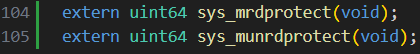
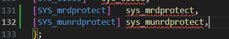
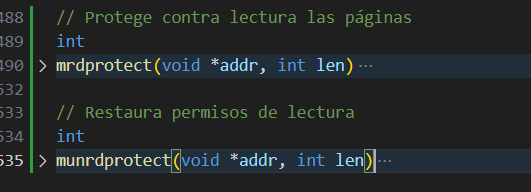
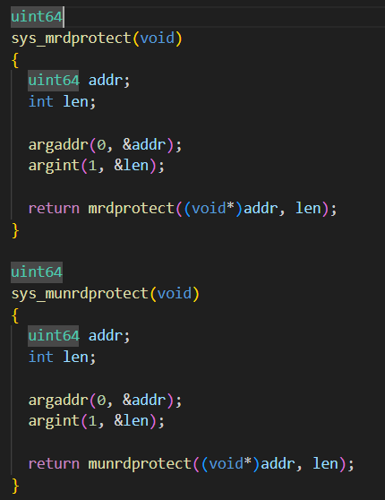
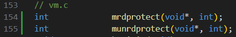
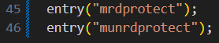
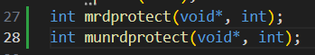
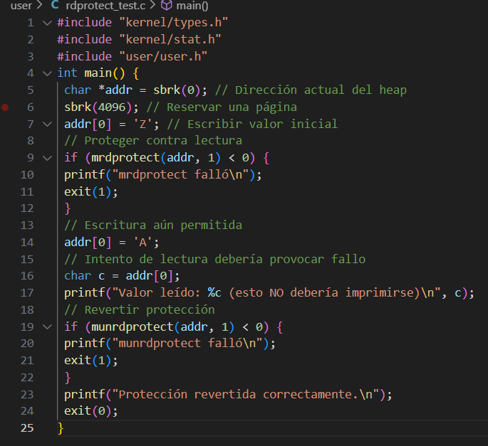
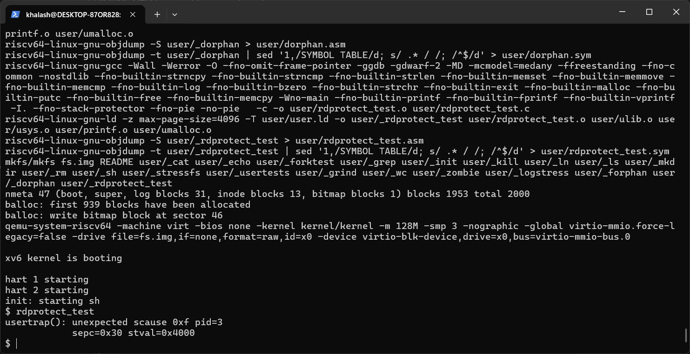
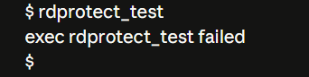

# Tarea 3: Protección de Lectura en XV6
30 de noviembre del 2025
Grupo A

# Objetivo del proyecto
Implementar dos llamadas al sistema (syscalls) en XV6:

mrdprotect(void *addr, int len): Protege páginas contra lectura
munrdprotect(void *addr, int len): Restaura permisos de lectura

Estas funciones manipulan directamente la tabla de páginas del proceso, modificando el bit PTE_R (Read) en las entradas de la tabla de páginas (PTEs).

# Diseño e Implementación
Arquitectura de la Solución
La implementación se basa en tres componentes principales:

# Interfaz de usuario (user/user.h, user/usys.pl)
Capa de syscalls (kernel/syscall.h, kernel/syscall.c, kernel/sysproc.c)
Implementación核心 (kernel/vm.c)

# Flujo de Ejecución
Proceso Usuario → syscall → sys_mrdprotect() → mrdprotect() → Modificación PTE → Hardware MMU

# Modificaciones Realizadas

1. Definición de Syscalls
Archivo: kernel/syscall.h

2. Archivo: kernel/syscall.c
Se registraron las funciones en el sistema:

3. Implementación de las Funciones Principales
Archivo: kernel/vm.c

4. Wrappers de Syscalls
Archivo: kernel/sysproc.c

5. Declaraciones y Exportaciones
Archivo: kernel/defs.h

Archivo: user/usys.pl

Archivo: user/user.h

6. Programa de Prueba
Archivo: user/rdprotect_test.c

Y modificar el makefile añadiendo:

	$U/_rdprotect_test\

En Uprogs

# Ejecución del programa de prueba

Al ejecutar el programa se obtiene lo siguiente:

Por lo que podemos interpretar que el programa fue ejecutado acorde al objetivo esperado.

# Dificultades encontradas

El mayor problema en general fue una corrupción de memoria del xv6

La solución fue cerrar qemu (ctrl + a luego x), ejecutar make clean, y luego make qemu
# Conclusiones
Se implementó exitosamente un mecanismo de protección de memoria a nivel de sistema operativo que permite crear regiones de memoria de solo escritura. Este proyecto ilustra cómo el sistema operativo puede proporcionar abstracciones de seguridad avanzadas manipulando directamente las estructuras de hardware de gestión de memoria.
